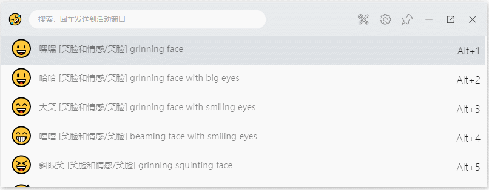

## 简介

快速搜索emoji，回车发送到活动窗口。
源代码在main分支: <https://github.com/pharaoh2012/utools_emojis>

### 主要功能

1. 支持中文、英文模糊搜索。
2. 支持空格搜索 `方块 绿色`,`绿色方块`，`绿色 方块`，`green square`都可以搜索出🟩 
3. 支持点击次数排序，点击次数越多，排序越靠前。
4. 适配暗黑模式
5. 增加繁体文本
6. 加载加载自定义对照表。

### 设置

1. 设置是否复制，是否输出到文本框
2. 选择对照表文件。
3. 加载自定义对照表。

[设置方法](./setting.md)
