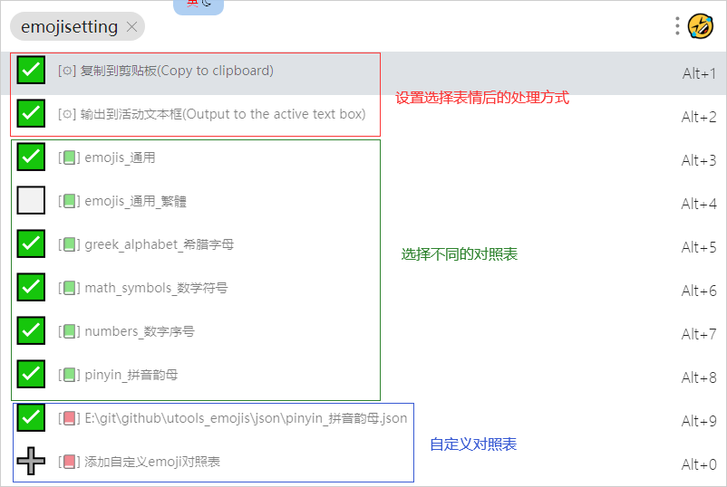

## 设置
使用`emojisetting`或`emoji设置`进入设置界面

- 以⚙为标志的是设置项目
- 以📗为标志的是插件内置的对照表
- 以📕为标志的是自定义对照表


## 自定义对照表格式
选择 `[📕] 添加自定义emoji对照表`选项后，弹出文件对话框选择对话框，选择自定义对照表。
自定义对照表为json文件，格式如下:
```json
[
  {
    "description": "数字序号，带圈的一,1",
    "keyword": "数字序号，带圈的,1,一,yi,one",
    "title": "①"
  },
  {
    "description": "数字序号，带圈的二,2",
    "keyword": "数字序号，带圈的,2,二,er,two",
    "title": "②"
  }
]
```
每个表情3个字段:

1. `title` : 表情，选择时复制或输出的内容
2. `description` 列表时显示的描述
3. `keyword` 搜索字段

内置的对照表参见: [https://github.com/pharaoh2012/utools_emojis](https://github.com/pharaoh2012/utools_emojis)
